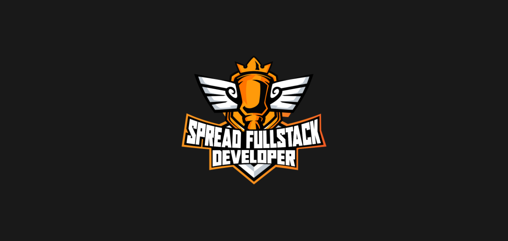
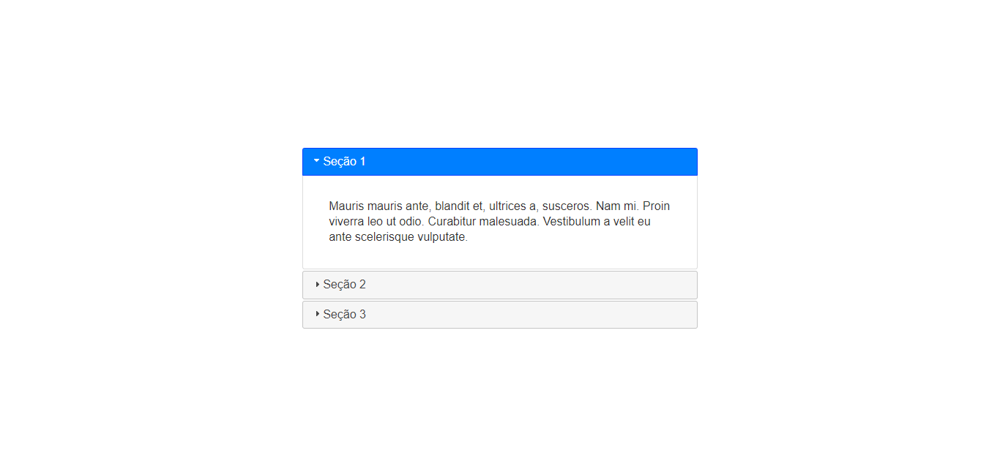
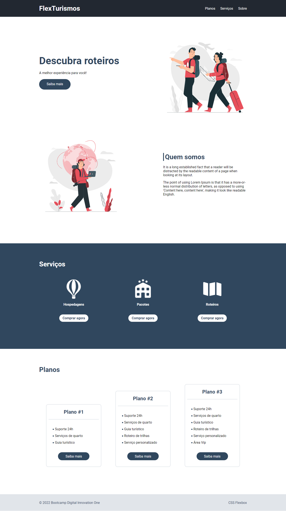

# Bootcamp Spread Fullstack Developer

Repositório para organizar os estudos e projetos realizados no Bootcamp Spread Fullstack Developer.

## Sobre

O Bootcamp Spread Fullstack Developer é um programa gratuito para pessoas desenvolvedoras que querem começar sua jornada em desenvolvimento de software com uma base sólida em tecnologias essenciais em front-end quanto e back-end.

## Visualização de entregas

### Módulo II - HTML/CSS3

**Primeiros passos para desenvolvimento web**

**Introdução a criação de websites com HTML5 e CSS3**

**Posicionando elementos com Flexbox em CSS**

**Recriando a página inicial do Instagram**

## Roteiro

Este modelo simples de lista de tarefas é usado para acompanhar o progresso dos estudos.

### Módulo I - Conteúdo de abertura

- [x] Boas-vindas ao Bootcamp: Spread Fullstack Developer
- [x] Mentoria #1: Aula inaugural - Spread
- [x] Lógica de Programação Essencial
- [x] Introdução ao Git e ao GitHub
- [x] Criando seu Primeiro Repositório no GitHub Para Compartilhar Seu Progresso

### Módulo II - HTML/CSS3

- [x] Primeiros passos para desenvolvimento web
- [x] Introdução a criação de websites com HTML5 e CSS3
- [x] Posicionando elementos com Flexbox em CSS
- [x] Recriando a página inicial do Instagram

### Módulo III - Javascript

- [x] Introdução ao JavaScript
- [x] Sintaxe e Operadores
- [x] Variáveis e Tipos
- [x] Funções
- [x] Coleções
- [x] Map, Filter e Reduce
- [ ] Debugging e Error Handling
- [ ] Javascript Assíncrono
- [ ] Orientação a objetos
- [ ] Trabalhando com Módulos em JavaScript
- [ ] Manipulando a D.O.M. com JavaScript
- [ ] Introdução ao TypeScript: Explorando Classes, Tipos e Interfaces
- [ ] Desafios Iniciais Js - Spread FullStack
- [ ] Aprenda a criar um sistema de estacionamento usando TypeScript

### Módulo IV - ReactJS

- [ ] Introdução ao ReactJS
- [ ] Introdução aos React Hooks
- [ ] Trabalhando com States & Effects no ReactJs
- [ ] Desenvolvimento de aplicações para internet com ReactJS
- [ ] Desafios Intermediários  Js - Spread FullStack
- [ ] Práticas avançadas em projetos com ReactJS
- [ ] Introdução a Redux com ReactJS
- [ ] Criando um front-end totalmente componentizado na prática com ReactJS

### Módulo V - Banco de Dados

- [ ] MySql - Trabalhando com as suas primeiras tabelas
- [ ] MySQL - Consultas com Join

### Módulo VI - NodeJS

- [ ] Introdução a APIs e métodos HTTP
- [ ] Desenvolvimento back-end com Node.js
- [ ] Introdução ao Node.js com Express
- [ ] Desafios Finais Js - Spread FullStack
- [ ] Explorando o Estilo Arquitetural REST com Node.js
- [ ] Node.js com Bancos de Dados Relacionais (SQL)
- [ ] Construindo Encurtador de URL

## Extras

Para mais informações sobre os Bootcamps da DIO, acesse [dio.me](https://www.dio.me/).

Conheça também a [Spread](https://spread.com.br/).
