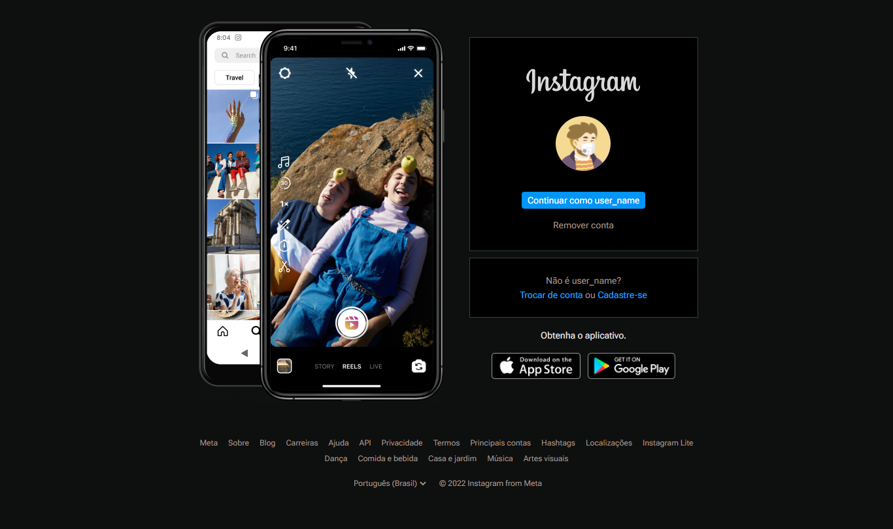

# Desafio de projeto

**Recriando a página inicial do Instagram**

Neste projeto, eu fui desafiado a recriar a página de login do Instagram. Aproveitei esta oportunidade para colocar em prática o uso do Flex Responsive CSS, uma das abordagens mais utilizadas para a disposição de elementos quando se trata de responsividade.

## Sobre

Para dar um toque pessoal ao projeto e descobrir mais possibilidades no desenvolvimento, optei por recriar a página usando cores escuras para torná-la mais agradável de ler.

Este foi um excelente desafio e resultou em uma experiência enriquecedora.